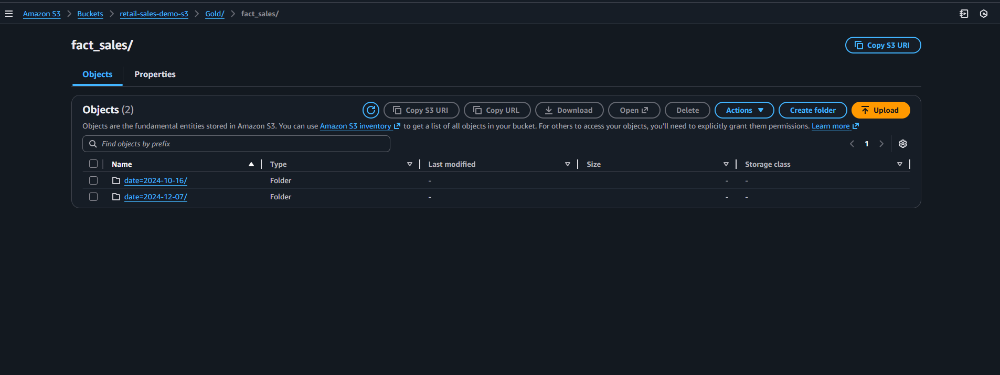
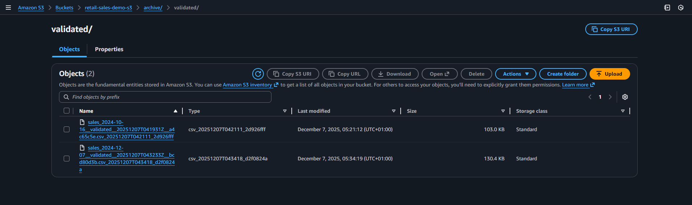
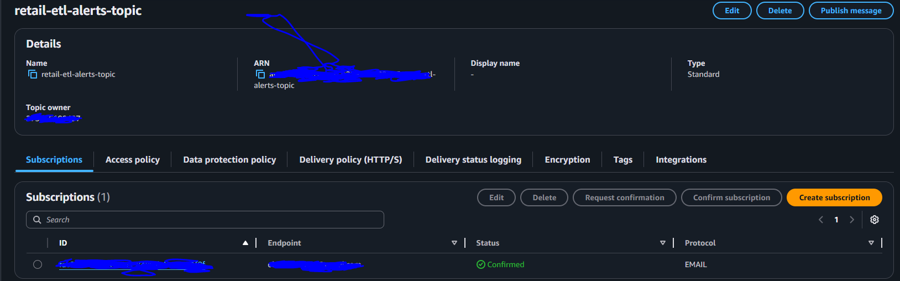

# Architecture Overview

```
s3://retail-sales-demo-s3/
│
├── raw/                               # Incoming unprocessed source files
│    └── <source_file.csv>
│
├── validated/                         # Files that passed Lambda validation
│    └── <source_file.csv>
│
├── rejected/
│    ├── system/                       # Complete-system failures (lambda or glue)
│    │     ├── <failed_file.csv>                   # Moved here on fatal error
│    │     └── <failed_file>_reason.json           # Includes stacktrace / failure details
│    │
│    └── data_quality/
│          ├── json/                   # Machine-readable row-level rejects
│          │     └── part-0000.json
│          │
│          └── csv/                    # Analyst-readable rejects (coalesced = 1)
│                └── part-0000.csv
│
├── processed/                         # Silver layer (clean, validated parquet)
│    └── date=YYYY-MM-DD/              # Partitioned by event date
│          ├── part-0000.snappy.parquet
│          ├── part-0001.snappy.parquet
│          └── ...
│
├── gold/                              # Gold layer (analytics-ready fact tables)
│    └── fact_sales/
│          └── date=YYYY-MM-DD/        # Partitioned by date, deduped & compacted
│                ├── part-0000.snappy.parquet
│                └── ...
│
├── audit/
│    └── gold_compaction/
│          ├── date=YYYY-MM-DD/
│          │      └── metrics.json     # Partition-level audit metrics
│          │
│          └── last_run_summary.json   # Job-level summary file
│
├── archive/
│    └── validated/
│          └── <original_filename>_<YYYYMMDDTHHMMSS>_<ingest_run_id>
│
└── logs/ (optional)
     └── glue/
```

## Layers:
- raw/: incoming source files
- validated/: files that passed Lambda validation
- processed/: parquet outputs from main Glue job (partitioned by date)


- gold/: compacted, deduplicated, analytics-ready fact tables (partitioned by date)



- rejected/: data_quality & system rejects (json + csv)


- archive/: archived original files after successful processing




## This system implements a serverless, event-driven, multi-stage data ingestion pipeline on AWS.
### Components:
- S3: data lake storage (raw, validated, processed, gold, rejected, archive)


- Lambda: lightweight validation, header check, delimiter detection, routing

- Glue (PySpark): heavy ETL to transform/clean/process data (raw -> processed)
- Glue (PySpark): GOLD compaction job (processed -> gold/fact_sales)


- Glue Crawler: optional to populate Glue Data Catalog for Athena


- SNS & CloudWatch: observability, alerts, and logging




## Atomicity and guarantees:
- Files never remain in raw/ or validated/ on success or failure
- Glue writes are atomic per partition; on failure partial outputs are removed and file moved to rejected/system
- Rejected rows are persisted with full context (raw_row, transaction_id, reject_reason, etc.)
